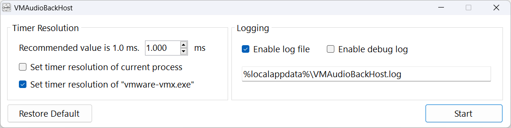

#  VMAudioBackHost
Another attempt to fix what VMAudioBack couldn't.

Do you have distort sound issue in your VMware VM? That VMAudioFixTray and VMAudioBack could not fix? If so, try this.

[Demo Video](./demo.mp4)

## Quick note

* Please run the program **on your host machine**, not Virtual Machine!

* Please press Start **after** you started your Virtual Machine.

* If it does not work, tick "Set timer resolution of current process" and try again.

* This program uses registry key: `HKEY_CURRENT_USER\Software\MaiSoft\VMAudioBackHost`.

* Antivirus might panic as this program injects DLL into VMware processes.

## Background on the sound issue

Before VMware 16.2, we could fix the sound issue by

* Playing music with Windows Media Player in the VM
* Changing Timer Resolution in the VM

Since VMware 16.2, many people reported that the sound issue came back, and they couldn't fix it.
After many trial and error, we found that when VirtualBox VM is running on Host Machine, VMware VM will NOT have sound issue.

Obviously, this is not good enough, but it was the best we could do.

## New discovery

Few days ago, [RibShark stated that this is caused by Timer Resolution](https://github.com/Raymai97/VMAudioBack/issues/3#issuecomment-1814011116) and shared [Windows Timer Resolution: The Great Rule Change](https://randomascii.wordpress.com/2020/10/04/windows-timer-resolution-the-great-rule-change/).

Basically, newer version of Windows 10/11 changed the Timer Resolution in such a way that "Alpha.exe" is much less likely to affect "Beta.exe".

Apparently you can revert this change by setting "GlobalTimerResolutionRequests" registry key, but I see people reporting it only works on Windows 11, not Windows 10.

> ... ideally a tool should be created to inject a timeBeginPeriod call into the relevant VMWare process.

I tested RibShark's idea with quick-dirty code. It works. I continued to work on it, and here we are today.

## My thought

* Windows 10 build 2004 or above caused the Timer Resolution to be per-process, so you cannot simply use any "Set Timer Resolution" tool floating on the Net, as VMware process may not be affected (read "benefited").

* Windows Hypervisor/WSL/Sandbox related stuff caused VMware to use alternative code path, causing audio issue that cannot be resolved by playing music in Windows Media Player in VM.
